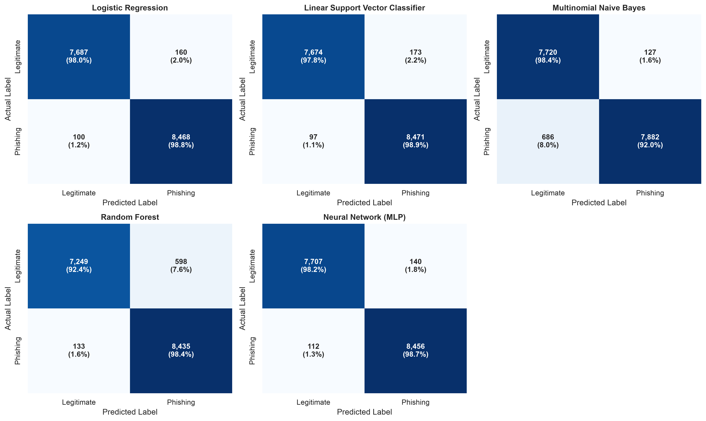
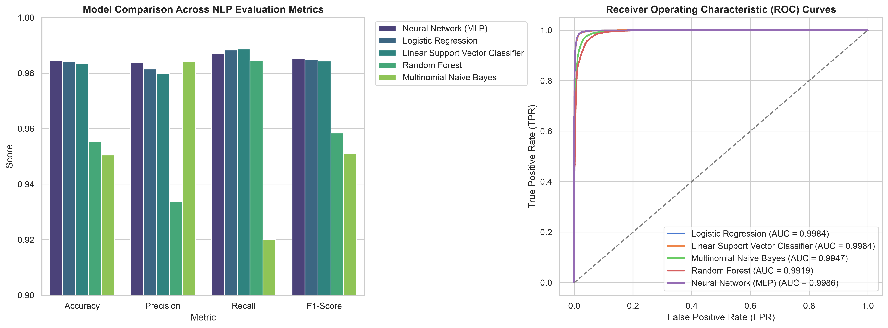
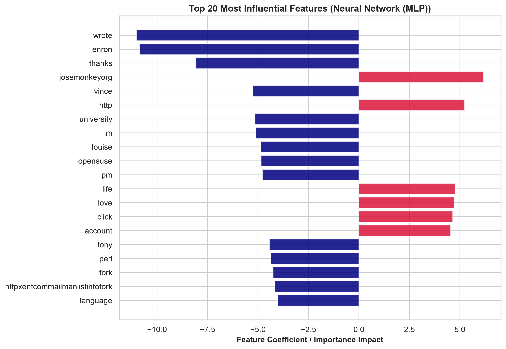

# 🛡️ AI-Driven Phishing Email Detection Using NLP & Machine Learning

An end-to-end, production-grade Natural Language Processing (NLP) and Machine Learning pipeline designed to detect phishing emails with high precision, zero data leakage, and real-time risk scoring.

---

## 🌟 Key Architecture & Technical Features

1. **🔒 Zero Data Leakage Guarantee**:
   - Stratified train/test split (80/20) performed **prior** to text vectorization and metadata scaling, ensuring strict isolation between training and unseen evaluation data.

2. **🛠️ Domain-Specific Phishing Feature Engineering**:
   - `url_count`: Extraction of standard URLs (`http://`, `https://`, `www.`).
   - `ip_url_count`: Detection of suspicious URLs containing raw IP addresses (`http://192.168.1.1`).
   - `urgent_word_count`: Urgency & phishing trigger count (`urgent`, `verify`, `suspended`, `account`, `password`, `security`, `bank`, `login`).
   - `capital_char_ratio`: Uppercase character intensity ratio.
   - `excl_count`: Exclamation mark intensity.
   - `text_length` & `word_count`: Email structural length metrics.

3. **📊 Sparse-Safe Feature Scaling (`MaxAbsScaler`)**:
   - Metadata features scaled to $[0, 1]$ while preserving sparse matrix formatting and non-negativity required for `MultinomialNB`.

4. **🔤 Advanced N-Gram Vectorization**:
   - `TfidfVectorizer` utilizing unigrams and bigrams (`ngram_range=(1, 2)`) with sublinear term frequency scaling (`sublinear_tf=True`) to capture phrase-level phishing patterns (`"account suspended"`, `"click here"`, `"verify identity"`).

5. **🤖 Production Inference Pipeline**:
   - End-to-end `predict_new_email()` function producing prediction labels (`🚨 PHISHING` / `✅ LEGITIMATE`), confidence scores, risk percentages, and detailed flag breakdowns.

---

## 📈 Model Benchmark Performance

Tested on **16,415 unseen emails** (stratified split from 82,073 total dataset):

| Model | Accuracy | Precision | Recall | F1-Score | ROC-AUC | Train Time |
| :--- | :---: | :---: | :---: | :---: | :---: | :---: |
| 👑 **Neural Network (MLP)** | **98.46%** | **98.37%** | **98.69%** | **98.53%** | **0.9986** | 5.79s |
| **Logistic Regression** | **98.42%** | **98.15%** | **98.83%** | **98.49%** | **0.9984** | 0.30s |
| **Linear Support Vector Classifier** | **98.36%** | **98.00%** | **98.87%** | **98.43%** | **0.9984** | 0.29s |
| **Random Forest** | **95.55%** | **93.38%** | **98.45%** | **95.85%** | **0.9919** | 2.01s |
| **Multinomial Naive Bayes** | **95.05%** | **98.41%** | **91.99%** | **95.10%** | **0.9947** | 0.01s |

---

## 🎨 Visualizations

| Confusion Matrices Grid | Model Metrics & ROC Curves |
| :---: | :---: |
|  |  |

| Feature Importance Analysis |
| :---: |
|  |

---

## 🔮 Production Inference Usage

```python
import joblib
from scipy.sparse import hstack, csr_matrix
import pandas as pd
import re

# Load serialized pipeline payload
pipeline = joblib.load("phishing_detector_pipeline.pkl")
model = pipeline["model"]
tfidf = pipeline["tfidf_vectorizer"]
scaler = pipeline["scaler"]

def analyze_email(raw_email):
    # Preprocessing
    clean = re.sub(r"[^a-z\s]", " ", str(raw_email)[:5000].lower()).strip()
    
    # Feature Extraction
    url_count = len(re.findall(r"https?://|www\.", raw_email))
    ip_url_count = len(re.findall(r"https?://\d{1,3}\.\d{1,3}\.\d{1,3}\.\d{1,3}", raw_email))
    urgent_count = sum(raw_email.lower().count(w) for w in ["urgent", "verify", "account", "suspended", "security"])
    cap_ratio = sum(1 for c in raw_email if c.isupper()) / (len(raw_email) + 1)
    excl_count = raw_email.count("!")
    
    meta_df = pd.DataFrame([{
        "url_count": url_count, "ip_url_count": ip_url_count,
        "urgent_word_count": urgent_count, "capital_char_ratio": cap_ratio,
        "excl_count": excl_count, "text_length": len(raw_email), "word_count": len(raw_email.split())
    }])
    
    # Vectorization & Scaling
    X_text = tfidf.transform([clean])
    X_meta = csr_matrix(scaler.transform(meta_df))
    X_comb = hstack([X_text, X_meta]).tocsr()
    
    # Prediction
    proba = model.predict_proba(X_comb)[0][1]
    return f"Phishing Risk Score: {proba:.2%}"

# Sample Test
print(analyze_email("URGENT: Your account at http://192.168.1.1 has been suspended! Verify immediately."))
```

---

## 📁 Repository Structure

```
├── Phising Email Detection.ipynb     # Main Jupyter Notebook
├── phishing_detector_pipeline.pkl    # Serialized model & NLP pipeline
├── comparative_analysis_real_data.csv# Exported evaluation metrics table
├── confusion_matrices_real_data.png # Confusion matrix plot grid
├── model_comparison_real_data.png    # Metrics comparison bar chart
├── roc_curves_real_data.png          # ROC curves comparison plot
├── feature_importance_real_data.png  # Top 20 feature importances
├── README.md                         # Project documentation
└── .gitignore                        # Git configuration
```

---

## 🚀 Quickstart

1. **Clone the Repository**:
   ```bash
   git clone https://github.com/ReshmanthSai/AI-Driven-Phishing-Email-Detection-NLP.git
   cd AI-Driven-Phishing-Email-Detection-NLP
   ```

2. **Install Dependencies**:
   ```bash
   pip install pandas numpy scikit-learn scipy matplotlib seaborn joblib
   ```

3. **Run Notebook / Predict**:
   Open `Phising Email Detection.ipynb` in Jupyter Notebook, VS Code, or Google Colab.
